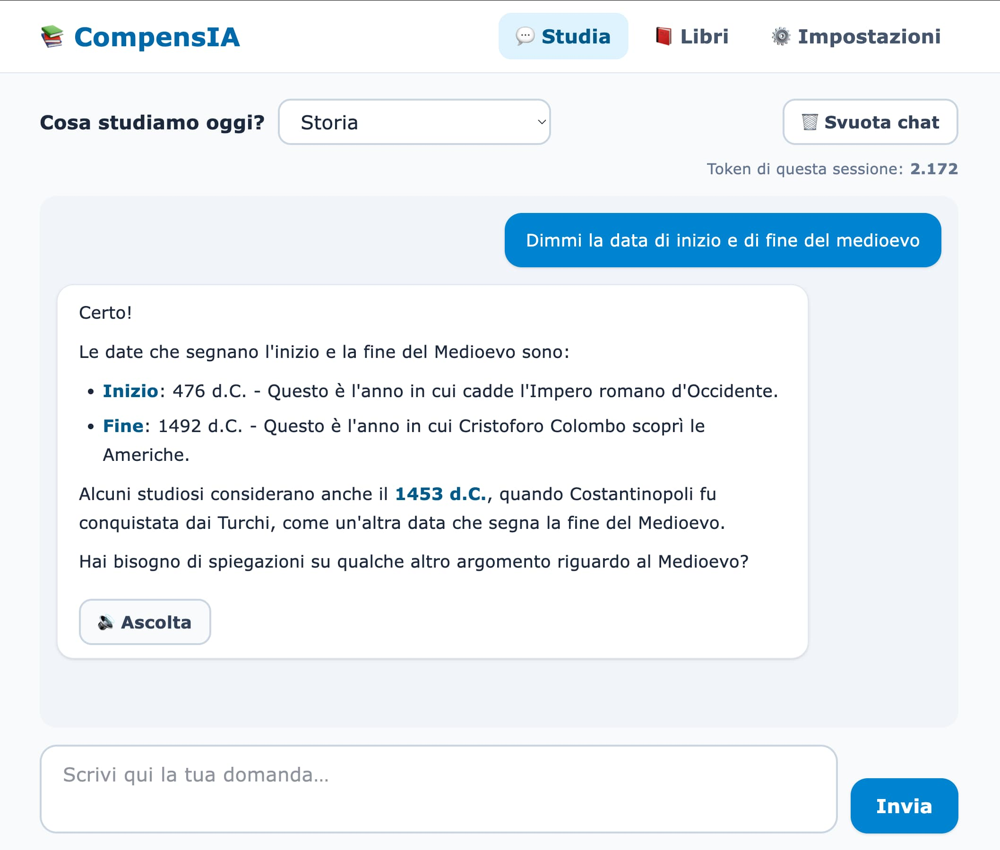
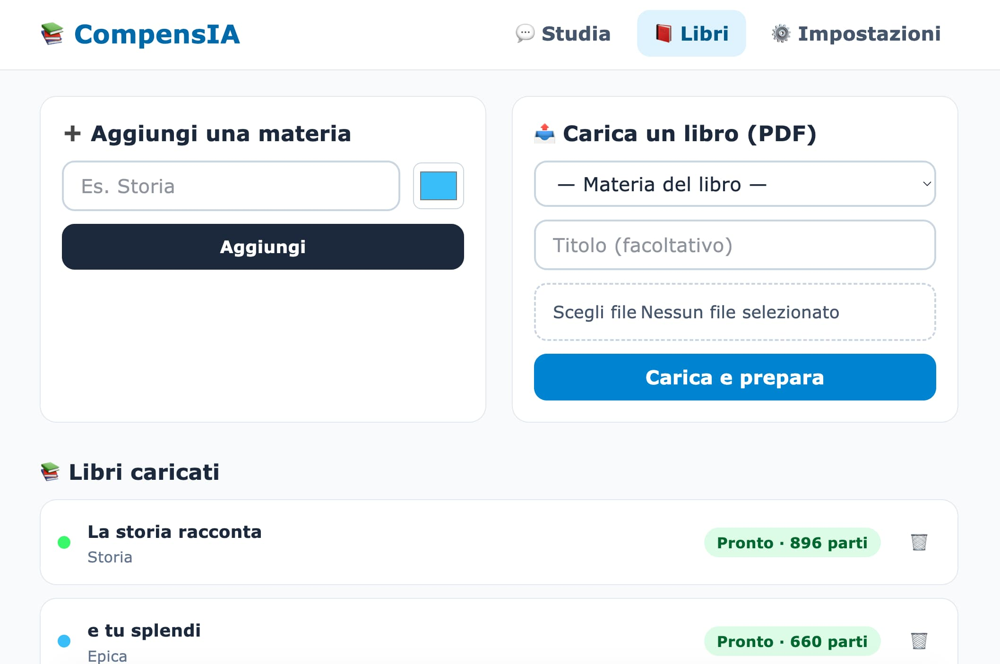
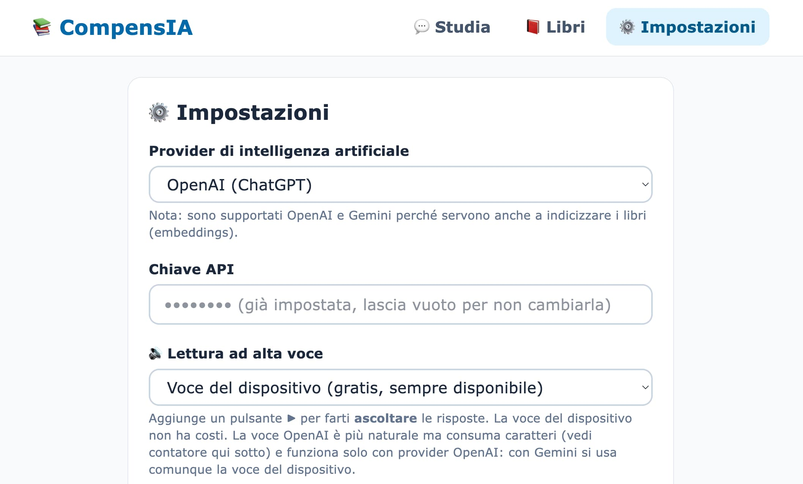

# CompensIA

<p>
  
  
  
  
  
  
  
</p>

**Assistente allo studio per ragazzi con DSA (Disturbi Specifici dell'Apprendimento).**

CompensIA permette di caricare i propri libri scolastici in PDF, organizzarli per
materia e studiare tramite una chat semplice e accessibile. Le risposte sono
generate da un modello linguistico ma **basate esclusivamente sul contenuto dei
libri caricati** (RAG — Retrieval-Augmented Generation), con un linguaggio pensato
per essere chiaro, paziente e incoraggiante.

L'applicazione è **locale e senza login**: i file dei libri, le chat e la chiave API
restano sul computer di chi la usa. Fa eccezione il provider LLM (OpenAI o Gemini),
a cui vengono inviati il testo dei libri per calcolarne gli *embeddings* e i passaggi
rilevanti insieme alle domande per generare le risposte.

## Caratteristiche

- 📚 **Libri per materia** — carica i PDF dei libri scolastici e organizzali per materia.
- 💬 **Chat sui tuoi libri** — fai domande e ricevi risposte basate solo sul materiale caricato, mai inventate.
- 🧠 **Pensata per i DSA** — frasi brevi, parole semplici, tono paziente. UI ad alto contrasto, font ampio, spaziatura generosa, pulsanti grandi, nessuna distrazione.
- 🔊 **Lettura ad alta voce** — un pulsante legge le risposte con la voce del dispositivo (gratis) o con la voce OpenAI (più naturale, a consumo), evidenziando le parole man mano (effetto karaoke).
- 🎤 **Dettatura vocale** — detta la domanda invece di scriverla (utile in caso di disgrafia): trascrizione OpenAI, con ripiego sul microfono del browser.
- 🗺️ **Mappe concettuali** — trasforma una risposta in una mappa concettuale (Mermaid) per vedere concetti e collegamenti a colpo d'occhio.
- 🔤 **Aiuti alla lettura** — pannello «Aa» per scegliere font ad alta leggibilità (Atkinson Hyperlegible, OpenDyslexic), dimensione del testo, spaziatura di righe e lettere, e un righello di lettura. Le preferenze restano salvate sul dispositivo.
- ⚡ **Risposte in streaming** — il testo compare progressivamente (SSE), come una conversazione reale.
- 🔒 **Locale e senza login** — nessun account: file dei libri, chat e chiave API (cifrata nel database) restano sul tuo computer. L'unico servizio esterno è il provider LLM scelto, a cui vengono inviati il testo dei libri (per gli embeddings) e i passaggi rilevanti insieme alle domande.
- 📊 **Consumo** — statistiche sui token della chat (totali e per sessione), più contatori separati per i caratteri letti dal TTS OpenAI e per i token della dettatura STT.

## Screenshot

<p>
  
  
  
</p>

## Come funziona (RAG per materia)

1. Carichi un libro PDF e lo assegni a una materia.
2. Un job in background estrae il testo (`pdftotext`), lo suddivide in blocchi e ne calcola gli *embeddings*.
3. Gli embeddings vengono salvati in un vector store **dedicato alla materia** (`storage/app/vector/{slug}.store`).
4. Quando fai una domanda, la chat recupera solo i passaggi rilevanti **della materia selezionata** e li usa come contesto per generare la risposta.

## Stack tecnologico

- **Laravel 12** · PHP 8.2+ (sviluppato su 8.4)
- **[NeuronAI](https://github.com/neuron-core/neuron-ai)** (`neuron-core/neuron-ai ^3`) — RAG, provider LLM, streaming, vector store, provider audio TTS/STT (solo OpenAI)
- **Tailwind CSS 4** (via Vite) · Vanilla JS per la chat SSE (`marked` + `dompurify` per il rendering markdown)
- **Mermaid** — mappe concettuali disegnate nel browser, caricato con import dinamico (code-split, solo al primo utilizzo)
- **Font ad alta leggibilità self-hosted** — Atkinson Hyperlegible e OpenDyslexic (`.woff2`), per gli aiuti alla lettura
- **SQLite** — usato anche per code (`queue`) e cache
- **Vector store su file** — `FileVectorStore`, uno per materia
- **poppler** (`pdftotext`) — estrazione del testo dai PDF

## Provider LLM

Sono supportati **OpenAI** e **Google Gemini**.

> Anthropic/Claude non è supportato: non offre API di *embeddings*, indispensabili al RAG.

Chat ed embeddings usano lo **stesso provider e la stessa chiave API**, configurati
dall'interfaccia in **Impostazioni** e salvati nel database (chiave cifrata). Finché
provider e chiave non sono valorizzati, l'app reindirizza a `/settings`.

## Requisiti

- PHP **8.2+**
- Composer
- Node.js e npm
- poppler (per `pdftotext`)
  ```bash
  # macOS
  brew install poppler
  # Debian/Ubuntu
  sudo apt-get install poppler-utils
  ```
  In sviluppo il binario viene trovato automaticamente sul PATH. In alternativa si può
  indicare un percorso esplicito con `POPPLER_BIN_PATH` in `.env`.

  > **Bundle NativePHP (delivery desktop futuro).** L'app distribuita a utenti che non hanno
  > poppler installato può includere il binario in `resources/bin/{Darwin,Windows,Linux}/pdftotext`
  > (su Windows `pdftotext.exe`): `app/AI/PopplerBinary` lo risolve automaticamente. Attenzione:
  > poppler è distribuito sotto licenza **GPL** — valutarne le implicazioni prima del rilascio.
- Una chiave API OpenAI **oppure** Google Gemini

## Installazione

```bash
# 1. Dipendenze PHP
composer install

# 2. Configurazione ambiente
cp .env.example .env
php artisan key:generate

# 3. Database (SQLite)
php artisan migrate

# 4. Frontend
npm install
npm run build   # oppure: npm run dev
```

In alternativa, lo script Composer `setup` esegue i passi principali in un colpo solo:

```bash
composer run setup
```

## Avvio

Servono più processi in esecuzione. Il modo più semplice:

```bash
composer run dev
```

Avvia contemporaneamente server, coda, log (Pail) e Vite.

In alternativa, manualmente in terminali separati:

```bash
php artisan serve        # server web
php artisan queue:work   # necessario per l'ingestione dei PDF
npm run dev              # asset frontend (in sviluppo)
```

> ⚠️ Il worker della coda (`queue:work`) è **indispensabile**: senza di esso i PDF caricati non vengono elaborati e restano in stato *pending*.

## Primo utilizzo

1. Apri l'app nel browser (di default `http://localhost:8000`).
2. Vai in **Impostazioni** e inserisci provider (OpenAI o Gemini), chiave API e modelli. Qui scegli anche il motore di lettura ad alta voce (voce del dispositivo o OpenAI) e trovi i contatori d'uso (token, caratteri TTS, token STT).
3. Crea una o più **materie**.
4. **Carica i libri** PDF e attendi che passino allo stato *pronto* (`ready`).
5. Seleziona una materia e inizia a **studiare in chat**.

## Architettura

Le classi principali del dominio AI vivono in `app/AI/`:

- **`StudyAgent`** (estende `RAG` di NeuronAI) — provider, embeddings, vector store e system prompt configurati **per materia** tramite `StudyAgentFactory`.
- **`SafeFileVectorStore`** — retrieval tollerante quando l'indice di una materia non esiste ancora.
- **`CountingOpenAIEmbeddingsProvider` / `CountingGeminiEmbeddingsProvider`** — calcolano gli embeddings accumulando i token consumati.
- **`StudyPrompt`** — system prompt orientato ai DSA (frasi brevi, parole semplici, risposte basate solo sul libro, mai inventare).

Altri componenti chiave:

- **`app/Jobs/IngestBookJob`** — estrae il testo dal PDF, calcola gli embeddings, li salva nel vector store della materia e aggiorna lo stato del libro (`pending` → `processing` → `ready` / `failed`).
- **`ChatController@stream`** — chat in **streaming SSE** via `response()->eventStream()` sugli eventi di `StudyAgent->stream(...)`.
- **`EnsureSettingsConfigured`** (middleware `settings`) — gate sulle impostazioni obbligatorie.

## Modello dati (SQLite)

| Tabella | Contenuto |
| --- | --- |
| `settings` | coppie key/value: `provider`, `api_key` (cifrata), `chat_model`, `embed_model` |
| `subjects` | materie: `name`, `slug`, `color` |
| `books` | `subject_id`, `title`, `path`, `status`, `chunk_count`, `embed_tokens`, `error_message` |
| `chat_sessions` | `subject_id`, `title`, `stt_tokens` (chiave `FileChatHistory` = `session-{id}`) |
| `chat_messages` | `role`, `content`, `input_tokens`, `output_tokens`, `embed_tokens`, `tts_chars` |

**Statistiche token:** i totali sono la somma su tutte le `chat_messages`; la "sessione
corrente" è filtrata sulla `chat_session` attiva. I token di chat provengono da
`response->getUsage()`, quelli di embedding dai `Counting*EmbeddingsProvider`.

I caratteri letti dal TTS OpenAI (`tts_chars`) e i token della dettatura STT (`stt_tokens`)
sono **contatori distinti**: non confluiscono nel totale dei token dell'LLM e si azzerano
quando si svuota la chat.

## Roadmap

- Delivery come app desktop tramite **NativePHP/Electron**.

## Licenza

Basato sullo scheletro Laravel, distribuito sotto licenza [MIT](https://opensource.org/licenses/MIT).
